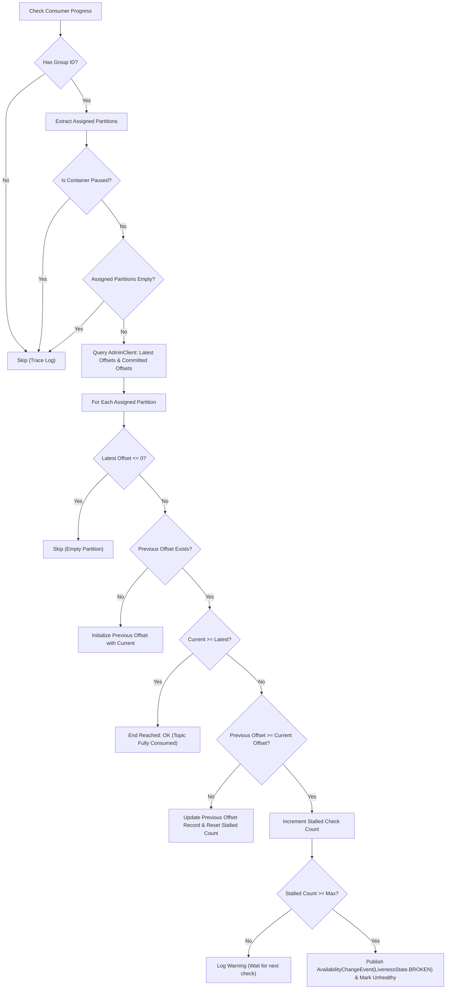

# Core Components

This document describes the internals of [`CommittedOffsetMovementCheck`](file:///c:/workdir/spring-liveness-indicators/src/main/java/io/github/vfem/livenesscheck/spring/kafka/CommittedOffsetMovementCheck.java), the primary service class of the library.

---

## 🔍 Class Summary: `CommittedOffsetMovementCheck`

- **Location**: [`src/main/java/io/github/vfem/livenesscheck/spring/kafka/CommittedOffsetMovementCheck.java`](file:///c:/workdir/spring-liveness-indicators/src/main/java/io/github/vfem/livenesscheck/spring/kafka/CommittedOffsetMovementCheck.java)
- **Implemented Interface**: `org.springframework.boot.actuate.health.HealthIndicator`
- **Key State Variables**:
  - `Map<String, Map<TopicPartition, OffsetAndMetadata>> groupsTopicPartitionOffsets`: Tracks historical committed offsets across `(groupId -> (TopicPartition -> OffsetAndMetadata))`.
  - `Map<TopicPartition, Integer> stalledChecksCount`: Tracks the number of consecutive stalled checks for each topic partition to avoid false positives.
  - `Set<MessageListenerContainer> containers`: Thread-safe set (`CopyOnWriteArraySet`) of active Spring Kafka `MessageListenerContainer` instances.
  - `AdminClient adminClient`: Native Kafka admin client used for querying topic and group metadata.
  - `long adminTimeoutMs`: Timeout in milliseconds for Kafka AdminClient RPC operations (default 5000ms).
  - `int maxStalledChecks`: Maximum consecutive health checks a partition can remain stalled before failing the probe (default 3).

---

## 🪞 Container Source Resolution & Extraction

To monitor offsets safely across all Kafka consumers without causing `ConcurrentModificationException` internally in the underlying Kafka consumer poll loops, the class resolves containers dynamically and natively via Spring Kafka's `MessageListenerContainer` APIs:

1. **Covered Container Sources**:
   - **All `KafkaListenerEndpointRegistry` Beans**: Automatically discovers all `@KafkaListener` method and class listeners across all registries in the application context (default and custom-named registries).
   - **All `MessageListenerContainer` Beans**: Automatically discovers standalone `ConcurrentMessageListenerContainer` and single-threaded `KafkaMessageListenerContainer` beans.
   - **Programmatic & Dynamic Containers**: Dynamically detects endpoints registered at runtime in `KafkaListenerEndpointRegistry` or added explicitly via `check.registerContainer(MessageListenerContainer)`.

2. **Hierarchy Unwrapping & Traversal**:
   - For `ConcurrentMessageListenerContainer`: Unwraps into child `KafkaMessageListenerContainer` instances via `getContainers()`, ensuring each consumer thread is tracked independently with its specific partition assignment. If child containers are not yet started or empty, tracks the container itself.
   - For standard `KafkaMessageListenerContainer`: Tracked directly.

3. **Partition Subscriptions & Pause States**:
   - Invokes `container.getContainerProperties().getGroupId()` to extract the group ID.
   - Invokes `container.getAssignedPartitions()` to get the assigned `Collection<TopicPartition>`.
   - Invokes `container.isContainerPaused()` and `container.isPauseRequested()` to determine if the container is paused, excluding it from evaluation if true.

---

## 🩺 On-Demand Health Indicator (`health()`)

When Spring Boot Actuator queries `/actuator/health` or `/actuator/health/liveness`, `CommittedOffsetMovementCheck.health()` executes:

```java
@Override
public Health health() {
    boolean healthy = checkConsumerProgress();
    return healthy ? Health.up().build() : Health.down().build();
}
```

---

## 📊 Offset Verification Algorithm (`checkConsumerProgress`)

For every tracked `MessageListenerContainer`:



### Key Decision Branches in Code:
1. **Empty / No Messages on Topic**: If `latestOffsetForPartition <= 0`, partition is skipped.
2. **First Check Run**: If no previous offset recorded, current committed offset (or 0) is saved as baseline.
3. **End of Topic Reached**: If `currentOffset >= latestOffset`, consumer is completely caught up, no failure raised.
4. **Tolerance Threshold**: If `previousOffset >= currentOffset` while `currentOffset < latestOffset`, the `stalledChecksCount` increments. It only triggers a failure when it reaches `maxStalledChecks` (default 3):
   ```java
   AvailabilityChangeEvent.publish(applicationContext, LivenessState.BROKEN);
   isHealthy.set(false);
   ```

---

## 🛑 Lifecycle & Teardown

- **Method**: [`shutdown()`](file:///c:/workdir/spring-liveness-indicators/src/main/java/io/github/vfem/livenesscheck/spring/kafka/CommittedOffsetMovementCheck.java#L268-L278) (annotated with `@PreDestroy`)
- **Teardown Flow**:
  1. Closes the `AdminClient` instance cleanly.

---

## 🔗 Related Documents

- [Architecture & Flow](file:///c:/workdir/spring-liveness-indicators/docs/architecture.md)
- [Testing Guide](file:///c:/workdir/spring-liveness-indicators/docs/testing-guide.md)
- [Configuration Reference](file:///c:/workdir/spring-liveness-indicators/docs/configuration-reference.md)
