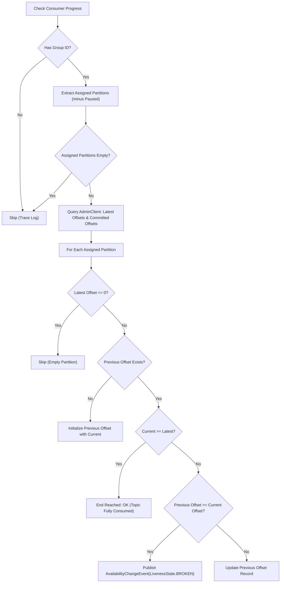

# Core Components

This document describes the internals of [`CommittedOffsetMovementCheck`](file:///c:/workdir/spring-liveness-indicators/src/main/java/io/github/vfem/livenesscheck/spring/kafka/CommittedOffsetMovementCheck.java), the primary service class of the library.

---

## 🔍 Class Summary: `CommittedOffsetMovementCheck`

- **Location**: [`src/main/java/io/github/vfem/livenesscheck/spring/kafka/CommittedOffsetMovementCheck.java`](file:///c:/workdir/spring-liveness-indicators/src/main/java/io/github/vfem/livenesscheck/spring/kafka/CommittedOffsetMovementCheck.java)
- **Key State Variables**:
  - `Map<String, Map<TopicPartition, OffsetAndMetadata>> groupsTopicPartitionOffsets`: Tracks historical committed offsets across `(groupId -> (TopicPartition -> OffsetAndMetadata))`.
  - `Set<KafkaConsumer<?, ?>> consumers`: Thread-safe set (`CopyOnWriteArraySet`) of active Kafka consumer instances.
  - `AdminClient adminClient`: Native Kafka admin client used for querying topic and group metadata.
  - `ScheduledExecutorService scheduledExecutor`: Single-threaded executor executing the periodic verification loop.

---

## 🪞 Reflection-Based Consumer Extraction

To monitor offsets without requiring invasive changes to consumer code, the class accesses underlying Kafka consumers via reflection on Spring's listener containers:

1. **Hierarchy Traversal**:
   - For `ConcurrentMessageListenerContainer`: Iterates over child `KafkaMessageListenerContainer` instances via `getContainers()`.
   - For `KafkaMessageListenerContainer`: Accesses private field `listenerConsumer` (`KafkaMessageListenerContainer$ListenerConsumer`).
   - From `listenerConsumer`: Accesses private field `consumer` to retrieve `KafkaConsumer<?, ?>`.
   - See [`extractKafkaConsumer(...)`](file:///c:/workdir/spring-liveness-indicators/src/main/java/io/github/vfem/livenesscheck/spring/kafka/CommittedOffsetMovementCheck.java#L128-L141).

2. **Partition Subscriptions & Pause States**:
   - Accesses `consumer.subscriptions` (instance of `SubscriptionState`).
   - Invokes `subscriptions.assignedPartitions()` to get assigned `Set<TopicPartition>`.
   - Invokes `subscriptions.pausedPartitions()` to get paused partitions and excludes them from check evaluation.
   - See [`extractAssigned(...)`](file:///c:/workdir/spring-liveness-indicators/src/main/java/io/github/vfem/livenesscheck/spring/kafka/CommittedOffsetMovementCheck.java#L272-L286) and [`extractPaused(...)`](file:///c:/workdir/spring-liveness-indicators/src/main/java/io/github/vfem/livenesscheck/spring/kafka/CommittedOffsetMovementCheck.java#L288-L302).

---

## 📊 Offset Verification Algorithm (`checkConsumerProgress`)

For every tracked `KafkaConsumer`:



### Key Decision Branches in Code:
1. **Empty / No Messages on Topic**: If `latestOffsetForPartition <= 0`, partition is skipped ([`L234-L237`](file:///c:/workdir/spring-liveness-indicators/src/main/java/io/github/vfem/livenesscheck/spring/kafka/CommittedOffsetMovementCheck.java#L234-L237)).
2. **First Check Run**: If no previous offset recorded, current committed offset (or 0) is saved as baseline ([`L239-L246`](file:///c:/workdir/spring-liveness-indicators/src/main/java/io/github/vfem/livenesscheck/spring/kafka/CommittedOffsetMovementCheck.java#L239-L246)).
3. **End of Topic Reached**: If `currentOffset >= latestOffset`, consumer is completely caught up, no failure raised ([`L253-L257`](file:///c:/workdir/spring-liveness-indicators/src/main/java/io/github/vfem/livenesscheck/spring/kafka/CommittedOffsetMovementCheck.java#L253-L257)).
4. **Stalled Consumer**: If `previousOffset >= currentOffset` while `currentOffset < latestOffset`, failure is triggered:
   ```java
   AvailabilityChangeEvent.publish(applicationContext, LivenessState.BROKEN);
   ```

---

## 🛑 Lifecycle & Teardown

- **Method**: [`shutdown()`](file:///c:/workdir/spring-liveness-indicators/src/main/java/io/github/vfem/livenesscheck/spring/kafka/CommittedOffsetMovementCheck.java#L338-L362) (annotated with `@PreDestroy`)
- **Teardown Flow**:
  1. Requests clean termination of `scheduledExecutor` with `shutdown()`.
  2. Awaits termination up to 5 seconds (`awaitTermination(5, TimeUnit.SECONDS)`).
  3. Escalates to `shutdownNow()` if timeout expires or thread is interrupted.
  4. Closes the `AdminClient` instance.

---

## 🔗 Related Documents

- [Architecture & Flow](file:///c:/workdir/spring-liveness-indicators/docs/architecture.md)
- [Testing Guide](file:///c:/workdir/spring-liveness-indicators/docs/testing-guide.md)
- [Configuration Reference](file:///c:/workdir/spring-liveness-indicators/docs/configuration-reference.md)
